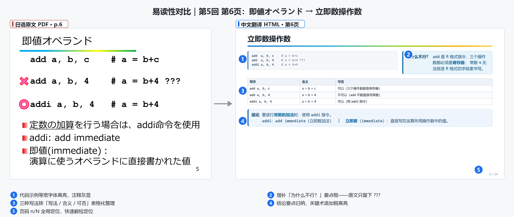
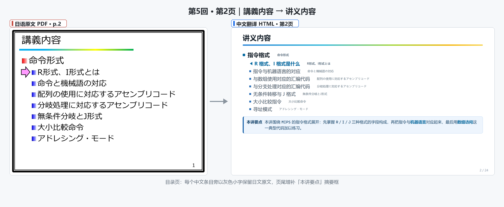
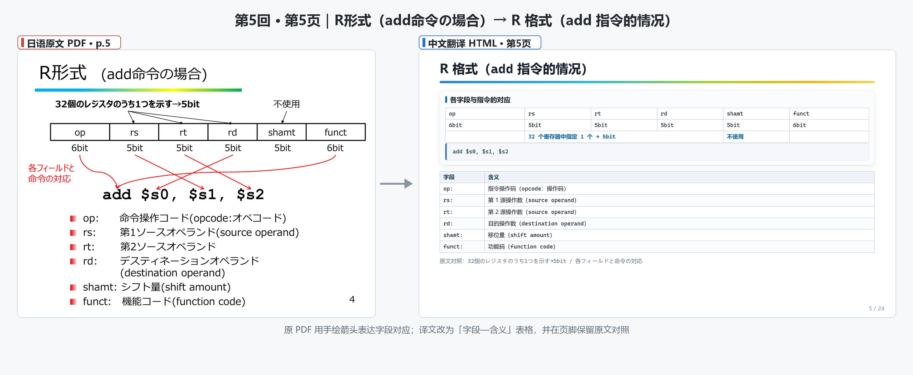
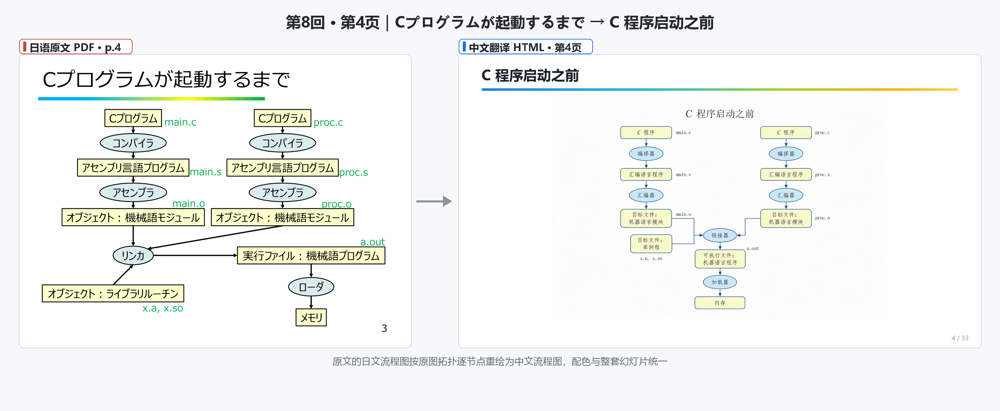

<h1 align="center">計算機構成論 全讲中文翻译</h1>

<p align="center">
  
</p>

<p align="center">
  
  
  
  
</p>

本项目是立命馆大学「計算機構成論」（计算机组成原理，双見京介老师，大工大·立命馆联合课程）日语讲义的**全量中文翻译项目**。原文是 8 份共 157 页的日文 PDF 讲义；译文将其**逐页重建为统一设计的中文 HTML 幻灯片**（每页 1280×720），并保证原文与译文**内容一一对应、可逐页核对**。仓库内同时保留原文 PDF、转换得到的 Markdown 中间稿，以及整套翻译校验脚本。

---

## ✨ 先看这里：相比原版 PDF，易读性提升在哪

<table>
<tr>
<th width="50%">日语原版 PDF</th>
<th width="50%">本项目中文版（HTML 幻灯片）</th>
</tr>
<tr>
<td>

- 全文日文，黑白讲义风，版式拥挤
- 手绘箭头、散排的文本框表达对应关系
- 关键结论只有只言片语（如只留一个 `???`）
- 图为日文原图，且 PDF 难以全文检索

</td>
<td>

- **中文为主，日文原文小字随行标注**，随时可回查原文
- 对应关系**重建为对齐的表格与配色面板**，箭头语义改用表格呈现
- **增补剖析要点框**：「本讲要点」「为什么不行？」等，把原文省略的推理补写出来
- **日文插图按原拓扑重绘为中文图**，全套配色统一
- 页脚 `n / N` **全局页码定位**；纯静态 HTML，**支持 Ctrl+F 全文检索**，浏览器/手机直接打开

</td>
</tr>
</table>

<p align="center">
  
</p>

<p align="center"><sub>同一页内容左右对照：译文侧新增了原文没有的「为什么不行？」剖析框与三种写法对比表。</sub></p>

## 📖 原文与译文，逐页一一对应

本项目最基本的约定：**HTML 第 N 张幻灯片 ↔ 原文 PDF 第 N 页**（讲义类严格 1:1：24↔24、32↔32、26↔26、31↔31、33↔33）。对照阅读时不需要来回搜索——页码即锚点。目录页每个中文条目旁保留日文原文小字，部分页面页脚还附「原文对照」一行原文短语，方便逐词核对。

**第 5 回 · 第 2 页（目录页）**——中文条目旁逐条标注日文原文：

<p align="center">
  
</p>

**第 5 回 · 第 5 页（R 格式与 add 指令）**——原 PDF 的手绘箭头对应，在译文中重建为「字段—含义」表格，并在页脚保留原文对照：

<p align="center">
  
</p>

**第 8 回 · 第 4 页（C 程序启动之前）**——原文的日文流程图按原图拓扑逐节点重绘为中文流程图，配色与整套幻灯片统一（该图使用火山引擎「豆包·Seedream」生成底稿后手工校正，提示词见 `.tools/gen/`）：

<p align="center">
  
</p>

## 📚 全部讲次对照表

| 讲次 | 主题 | 原文 PDF（日语原文/） | 中文译文（中文翻译/） | 页数 |
|---|---|---|---|---|
| 第1回 | 复习题解 | `Sol1.pdf` | `計算機構成論第1回_复习题解.html` | 3 → 4 |
| 第2回 | 计算机中的数值表示（1） | `2-Modified.pdf` | `計算機構成論第2回.html` | 31 ↔ 31 |
| 第3回 | 复习题解 | `Sol3.pdf` | `計算機構成論第3回_复习题解.html` | 4 → 5 |
| 第4回 | 复习题解 | `Sol4.pdf` | `計算機構成論第4回_复习题解.html` | 4 → 5 |
| 第5回 | 指令集体系结构（2） | `計算機構成論第5回.pdf` | `計算機構成論第5回.html` | 24 ↔ 24 |
| 第6回 | 指令集体系结构（3） | `計算機構成論第6回.pdf` | `計算機構成論第6回.html` | 32 ↔ 32 |
| 第7回 | 指令的执行（1） | `計算機構成論第7回.pdf` | `計算機構成論第7回.html` | 26 ↔ 26 |
| 第8回 | 指令的执行（2） | `計算機構成論第8回.pdf` | `計算機構成論第8回.html` | 33 ↔ 33 |

> 讲义类逐页严格对应；复习题解因原文每页多题连排，译文按题拆页展示，题号与原题一一对应，故页数略有增加（`→`）。

## 🗂 目录结构

```
trans-for-CS/
├─ 日语原文/                 # 原版日文讲义 PDF（8 份，157 页）
├─ 日语原文-md/              # pdf2md.py 生成的 Markdown 中间稿（带 <!-- page N --> 页码锚点）
│  └─ assets/                # 从 PDF 中提取的原始插图
├─ 中文翻译/                 # 成品：中文 HTML 幻灯片，浏览器直接打开
│  ├─ assets/                # slides.css（整套设计系统）、重绘与生成插图
│  └─ 計算機構成論第N回*.html
├─ docs/img/                 # 本 README 展示图（对照图由 .tools/make_readme_images.py 合成）
└─ .tools/                   # PDF→MD、术语校验、版式检查、截图与对照图合成脚本
```

## 🔧 制作流程：从 PDF 到可校验的中文幻灯片

```
日语原文 PDF ──pdf2md.py──▶ Markdown 中间稿（页码锚点 + 提图）
      │                          │
      │                          ▼
      │                   逐页翻译 + 版式重建（HTML 1280×720 幻灯片）
      │                          │
      │                 terms_check.py（术语无遗漏）+ check_overflow.py（无溢出）
      │                          │
      ▼                          ▼
原文 PDF 页面截图 ◀──shot_*──▶ 译文幻灯片截图 ──▶ 左右对照图（本 README 素材）
```

**翻译约定**

- 课程术语采用统一译名，并在**首次出现处随行标注日文原文**；目录页逐条双语对照。常用术语示例：

  | 日语原文 | 中文译名 | 英文参照 |
  |---|---|---|
  | 命令形式 | 指令格式 | instruction format |
  | 機械語 | 机器语言 | machine language |
  | 即値 | 立即数 | immediate |
  | オペランド | 操作数 | operand |
  | レジスタ | 寄存器 | register |
  | 配列 | 数组 | array |
  | 分岐処理 | 分支处理 | branching |
  | 無条件分岐 | 无条件转移 | unconditional jump |
  | アドレシング・モード | 寻址模式 | addressing mode |
  | シフト量 | 移位量 | shift amount |

- 指令名、寄存器名（`add $s0, $s1, $s2`、`op/rs/rt/rd` 等）**保持原文不译**；
- 原文的加粗、红字强调 → 译文的**关键词蓝色高亮**；代码示例统一等宽字体 + 注释灰显；
- 原文省略的推理（如「`add a, b, 4` 为什么不行」）以**要点框形式增补**，不改动原文语义。

## 🔍 质量校验工具（.tools/）

| 脚本 | 作用 |
|---|---|
| `pdf2md.py` | 将 `日语原文/*.pdf` 转为版式感知的 Markdown（页码标记、插图、代码块识别） |
| `terms_check.py` | 从原文提取术语/寄存器名/数字/填空 token，**逐一检查译文中无遗漏** |
| `check_overflow.py` / `verify_deck.py` | 用 Playwright 检查每页内容是否溢出画布，并一键截取全套幻灯片 |
| `shot_html_slides.py` / `shot_pdf_pages.py` | 分别对译文幻灯片与原文 PDF 页面截图 |
| `make_readme_images.py` | 将原文/译文截图合成为本 README 的左右对照图 |
| `gen/` | 火山引擎「豆包·Seedream」生图提示词（封面底图、流程图重绘底稿） |

## 🚀 使用方式

无需安装任何依赖：

```bash
# 方式一：直接双击打开（assets/ 需与 HTML 同目录）
中文翻译/計算機構成論第5回.html

# 方式二：本地起个静态服务后访问
cd 中文翻译 && python -m http.server 8000
# 浏览器访问 http://localhost:8000
```

每页均为 1280×720 幻灯片，纵向滚动即翻页；页脚 `n / N` 可随时定位到与原 PDF 相同的页。

## 📄 说明与致谢

- 原讲义版权归立命馆大学 双見京介（Futami Kyosuke）老师所有，本项目仅为个人学习用途的翻译与整理，请勿用于商业用途。
- README 中的对照图由项目脚本自动截图合成；横幅与部分插图素材使用火山引擎「豆包·Seedream 5.0」生成。
