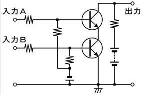
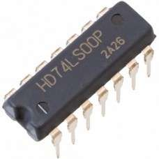
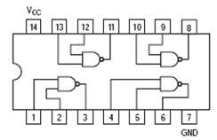
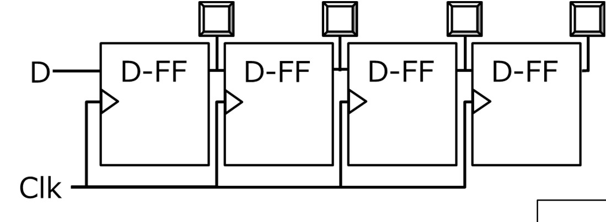
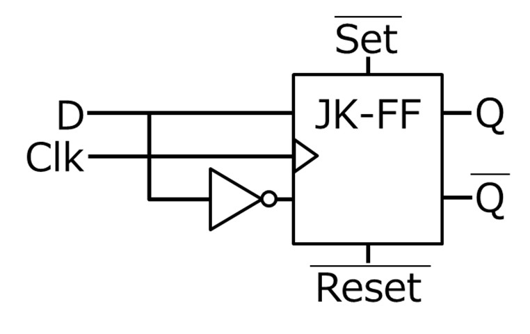
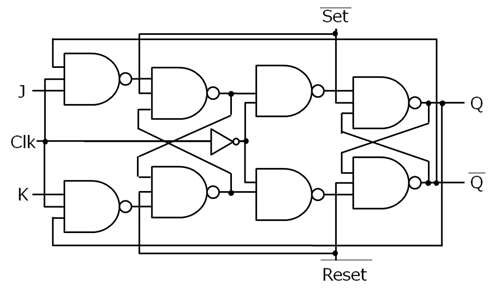
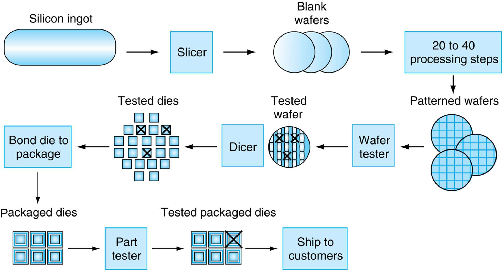

<!-- page 1 -->
# 計算機構成論第2回

―計算機における数値表現(1)―  
大連理工大学・立命館大学国際情報ソフトウェア学部  
山下 茂・双見 京介

<!-- page 2 -->
## 講義内容

プロセッサ・メモリを構成するもの  
トランジスタ、論理素子、IC  
2進数  
2進数、16進数とは  
2進数と10進数の変換  
負数の表現、2の補数

<!-- page 3 -->
## プロセッサ・メモリを構成するもの

トランジスタ  
電気的なON/OFF切り替えができる  
ゲート（ポリシリコン） 絶縁膜（SiO2）  
アルミ配線  
n 型 n 型  
p 型基板  
（ソース） （ドレイン）  
CMOS（Complementary Metal Oxide Semiconductor）が主流

<!-- page 4 -->
## プロセッサ・メモリを構成するもの

論理ゲート(論理素子)

基本的な論理演算に対応する電子回路  
AND, OR, NOT, NAND, NOR, XORなど

<!-- page 5 -->
## プロセッサ・メモリを構成するもの

集積回路(integrated circuit)  
数十個から数百万個のトランジスタを  
集積した電子素子  
チップ(chip) とも呼ばれる

(例) NANDゲート4つで構成されたIC

<!-- page 6 -->
## プロセッサ・メモリを構成するもの

記憶回路で情報を記憶(例:レジスタ)

4bitシフトレジスタ  
D-FF

JK-FF

<!-- page 7 -->
## プロセッサ・メモリを構成するもの

LSI (large scale integration)  
大規模集積回路  
特に大規模なICのこと  
千～数十万個のトランジスタを集積  
VLSI (very -)  
数十万～数百万個のトランジスタを集積  
ULSI (ultra -)  
1000万個以上のトランジスタを集積

<!-- page 8 -->
## Pentium4チップの製造

参考  
1. シリコンインゴットを薄切り(～2.5mm)  
にしてウェーハを作成  
2. ウェーハに一連の加工を施して  
トランジスタ、導体、絶縁体からなる  
回路を作成  
3. ウェーハのテストを行う  
(欠陥が見つかったものは製品として使わない)  
4. ウェーハからダイ(チップ)を切り出す  
5. ダイのテストを行う  
(欠陥が見つかったものは製品として使わない)  
6. ダイをパッケージ化  
7. 部品テスト  
8. 問題のなかったものを出荷

<!-- page 9 -->
## ソースコードから機械語へ

C言語 アセンブリ言語 機械語  
int a,b,c,d; lw $9, 4($1) 01001101  
a = b + c;  
lw $10, 8($1) 00100100  
d = a * b;  
add $8,$9,$10 01001000  
... ... 00100000  
そのままでは コンパイラ アセンブラ そのまま回路上  
実行できない  
で実行可能  
により変換 により変換  
高級言語のプログラムは、コンパイラ、  
アセンブラ等により機械語のコードに変換される  
アセンブリ言語と機械語の命令は  
1対1対応

<!-- page 10 -->
## 確認問題

AND、OR、NOTなどの論理を実現する  
ための素子を **( 1 )** と呼ぶ。  
次の用語を英語に直せ。  
**(2)** 集積回路  
**(3)** 大規模集積回路  
高級プログラミング言語からアセンブリ  
言語のコードへの変換は、**( 4 )**が行う。  
アセンブリ言語から機械語への変換は、  
**( 5 )**が行う。

<!-- page 11 -->
## 講義内容

プロセッサ・メモリを構成するもの  
トランジスタ、論理素子、IC  
2進数  
2進数、16進数とは  
2進数と10進数の変換  
負数の表現、2の補数

<!-- page 12 -->
## 2進数、10進数、16進数

2進数:  
0～1で表現した数値  
10進数:  
0～9で表現した数値  
16進数:  
0～9,a～fで表現した数値  
※大文字(A～F)でも良い

| 10進数 | 2進数 | 16進数 |
| ---- | ----- | ---- |
| 0 | 00000 | 00 |
| 1 | 00001 | 01 |
| 2 | 00010 | 02 |
| 3 | 00011 | 03 |
| 4 | 00100 | 04 |
| 5 | 00101 | 05 |
| 6 | 00110 | 06 |
| 7 | 00111 | 07 |
| 8 | 01000 | 08 |
| 9 | 01001 | 09 |
| 10 | 01010 | 0a |
| 11 | 01011 | 0b |
| 12 | 01100 | 0c |
| 13 | 01101 | 0d |
| 14 | 01110 | 0e |
| 15 | 01111 | 0f |
| 16 | 10000 | 10 |

<!-- page 13 -->
## 2進数とコンピュータ

コンピュータ内部では、  
電位(電圧: voltage)が高いか低いかを  
1、0に割り当て  
コンピュータ内部のデータや命令は  
すべて2進数で表現  
同じ?

同じ2進数でも、  
いろいろな解釈がありうる  
→解釈のルールが重要

| 123 (整数) | 01111011 |
| ----------- | -------- |
| A (文字) | 01000001 |
| load word命令 | 00100011 |
| 35 (整数) | 00100011 |

<!-- page 14 -->
## 2進数

2進数:0と1のみで表現された数値  
基数は右下に小さく書く  
10進数の1111 → 111110  
2進数の1111 → 11112  
最上位ビット 最下位ビット  
(MSB: most significant bit)  
(LSB: least significant bit)

<!-- page 15 -->
## 2進数と10進数の変換

2進数→ 10進数  
111110 = 1*1000+1*100+1*10+1*1  
= 1*103+1*102+1*101+1*100  
11112 = 1*23+1*22+1*21+1*20  
= 1*8+1*4+1*2+1*1  
= 1510  
10進数→ 2進数  
11/2 = 5 余り1  
5/2 = 2 余り1  
1110 → 10112  
1011  
2/2 = 1 余り0  
1/2 = 0 余り1

<!-- page 16 -->
## 2進数と16進数の変換

2進数→ 16進数  
4ビットずつ  
区切って  
右の表に  
従って変換  
例) 010111102  
→ 5E16  
16進数→ 2進数  
右の表に従って

| 16進数 | 2進数 |
| ---- | ---- |
| 0 | 0000 |
| 1 | 0001 |
| 2 | 0010 |
| 3 | 0011 |
| 4 | 0100 |
| 5 | 0101 |
| 6 | 0110 |
| 7 | 0111 |

| 16進数 | 2進数 |
| ---- | ---- |
| 8 | 1000 |
| 9 | 1001 |
| A | 1010 |
| B | 1011 |
| C | 1100 |
| D | 1101 |
| E | 1110 |
| F | 1111 |

4ビットずつ変換

<!-- page 17 -->
## 2進数の負数表現-絶対値表現-

4ビットでは  
表現不可能

| 10進数 | 2進数 |
| ---- | ---- |
| -8 | - |
| -7 | 1111 |
| -6 | 1110 |
| -5 | 1101 |
| -4 | 1100 |
| -3 | 1011 |
| -2 | 1010 |
| -1 | 1001 |
| -0 | 1000 |

| 10進数 | 2進数 |
| ---- | ---- |
| 8 | - |
| 7 | 0111 |
| 6 | 0110 |
| 5 | 0101 |
| 4 | 0100 |
| 3 | 0011 |
| 2 | 0010 |
| 1 | 0001 |
| 0 | 0000 |

符号(1:負数, 0:正数) ＋絶対値

<!-- page 18 -->
## 2進数の負数表現-1の補数-

4ビットでは  
表現不可能

| 10進数 | 2進数 |
| ---- | ---- |
| -8 | - |
| -7 | 1000 |
| -6 | 1001 |
| -5 | 1010 |
| -4 | 1011 |
| -3 | 1100 |
| -2 | 1101 |
| -1 | 1110 |
| -0 | 1111 |

| 10進数 | 2進数 |
| ---- | ---- |
| 8 | - |
| 7 | 0111 |
| 6 | 0110 |
| 5 | 0101 |
| 4 | 0100 |
| 3 | 0011 |
| 2 | 0010 |
| 1 | 0001 |
| 0 | 0000 |

0と1を反転

<!-- page 19 -->
## 2進数の負数表現-2の補数-

4ビットでは  
表現不可能

| 10進数 | 2進数 |
| ---- | ---- |
| -8 | 1000 |
| -7 | 1001 |
| -6 | 1010 |
| -5 | 1011 |
| -4 | 1100 |
| -3 | 1101 |
| -2 | 1110 |
| -1 | 1111 |
| -0 | 0000 |

| 10進数 | 2進数 |
| ---- | ---- |
| 8 | - |
| 7 | 0111 |
| 6 | 0110 |
| 5 | 0101 |
| 4 | 0100 |
| 3 | 0011 |
| 2 | 0010 |
| 1 | 0001 |
| 0 | 0000 |

1の補数+1

<!-- page 20 -->
## 負数の2の補数を取ると?

| 10進数 | 2進数 |
| ---- | ---- |
| -8 | 1000 |
| -7 | 1001 |
| -6 | 1010 |
| -5 | 1011 |
| -4 | 1100 |
| -3 | 1101 |
| -2 | 1110 |
| -1 | 1111 |
| -0 | 0000 |

| 10進数 | 2進数 |
| ---- | ---- |
| 8 | - |
| 7 | 0111 |
| 6 | 0110 |
| 5 | 0101 |
| 4 | 0100 |
| 3 | 0011 |
| 2 | 0010 |
| 1 | 0001 |
| 0 | 0000 |

1の補数+1

<!-- page 21 -->
## 2の補数の利点

最上位ビットを見ると、符号がわかる  
1→マイナス、0→プラス  
\-0 がない  
加算が簡単にできる  
符号拡張も簡単にできる  
符号拡張:より多くのビットを  
使った値に変換すること(8bit->16bit)

<!-- page 22 -->
## 2進数と10進数の変換

2進数→ 10進数(符号なし)  再掲  
11112 = 1*23+1*22+1*21+1*20  
= 1*8+1*4+1*2+1*1  
= 1510  
2進数→ 10進数(符号あり)  
11112 = **-**1*23+1*22+1*21+1*20  
= **-**1*8+1*4+1*2+1*1  
= -110

<!-- page 23 -->
## 2の補数変換の正当性

なぜビット反転して1足せば良いのか?  
a3a2a1a0+~a3~a2~a1~a0=11112  
a3a2a1a0+(~a3~a2~a1~a0+1)=100002=0  
(a3a2a1a0+1)+~a3~a2~a1~a0=100002=0  
a3a2a1a0 = -23a3+22a2+21a1+20a0  
~a3~a2~a1~a0 = -23 ~a3+22 ~a2+21 ~a1+20 ~a0  
a3a2a1a0+~a3~a2~a1~a0  
=-23+22+21+20=-1

<!-- page 24 -->
## 確認問題

(1) 符号なし整数101010102 を  
10進数に変換せよ。  
(2) 符号なし整数111100102 を  
16進数に変換せよ。  
(3) 2310 を8ビットの2進数に変換せよ。  
(4) 2310 を16進数に変換せよ。  
(5) -2110 を絶対値表現で8ビットの2進数に変換せよ。  
(6) -2110 を1の補数表現で8ビットの2進数に変換せよ。  
(7) -2110 を2の補数表現で8ビットの2進数に変換せよ。  
(8) 2の補数表現で、8ビットで表現できる  
数値の範囲を答えよ。

<!-- page 25 -->
## 参考文献

コンピュータの構成と設計上第5版  
David A.Patterson, John L. Hennessy 著、  
成田光彰訳、日経BP社  
山下茂「計算機構成論１」講義資料  
画像は著作権で保護されている可能性がありますので、  
公開・頒布を禁止します。

<!-- page 26 -->
## 以下，追加参照資料

<!-- page 27 -->
## nMOSトランジスタ（スイッチとなる） 参考

ゲート（ポリシリコン） 絶縁膜（SiO2）  
アルミ配線  
n 型 n 型  
p 型基板  
（ソース） （ドレイン）  
ゲートに電圧を加えるとソース、ドレイン間に電子が集まる。  
**→**電気が流れる。  
入力  
• ゲート入力が 0 V だとオフ  
• ゲート入力が 5 V だとオン

<!-- page 28 -->
## LSIの製造工程の流れ

参考書図1.12 (英語版）

<!-- page 29 -->
## 符号なし整数の2進数表現 (1/2) 復習？

2n-1 23 22 21 20 桁に重みを割り当て  
• 0, 1 の並びで整数を表す方法  
• ２を基数 (radix/base number)として整数を表す方法  
• 0000, 0001, 0010, 0011, …, 1110, 1111  
正の整数Xに対するn桁の2進数  
(xn-1 xn-2 … x1 x0 )2 xi ∈ {0,1}  
X = xn-12n-1+xn-22n-2+…+ x12+ x0  
各桁をビット(bit: binary digit)  
最上位桁をMSB(Most Significant Bit) と呼ぶ  
最下位桁をLSB(Least Significant Bit) と呼ぶ

<!-- page 30 -->
## 符号なし整数の2進数表現 (2/2)

復習？  
10進数 2進数 16進数  
0 00000 00  
nビットだと0 から 2n - 1   までの数を表現可  
1 00001 01  
2 00010 02  
3 00011 03  
4 00100 04  
5 00101 05 8 ビットの例  
6 00110 06 0 から 255 まで  
7 00111 07 00000000  
8 01000 08  
9 01001 09 11111111  
10 01010 0a 00101010  
11 01011 0b  
12 01100 0c など  
13 01101 0d  
14 01110 0e  
15 01111 0f  
27 26 25 24 23 22 21 20  
16 10000 10  
17 10001 11

<!-- page 31 -->
## 符号付き整数の表現

復習？  
• 最上位の桁に負の重みを持たせる表現法  
• n ビットで、-2n-1 から 2n-1-1 までの数を表す  
• 8 ビットの例  
• -128 から 127 まで  
• 10000000, 01111111, 10000001, 11111111  
\-27 26 25 24 23 22 21 20  
1 0 0 0 0 0 0 0 = -27= -128  
\-2n-1  
1 0 0 0 0 0 0 1 = -27+ 20= -127  
0 1 0 0 0 0 0 1 = 26+ 20= 65  
2n-1-1  
0 1 1 1 1 1 1 1 = 127  
1 1 1 1 1 1 1 1 = -1？  
最上位ビットは、符号ビットと呼ばれる
