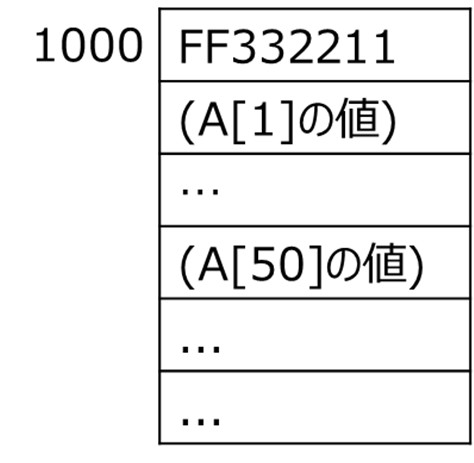

<!-- page 1 -->
# 確認問題

次の説明に合う用語を答えなさい。  
(1) コンピュータ言語の言葉 **命令**  
(2) コンピュータの語彙(一揃いの命令) **命令セット**  
(3) 1命令でできることは少ないが、  
命令が単純となるような命令セットの設計方針 **RISC**  
(4) 1命令でできることが多いが、  
命令が複雑となるような命令セットの設計方針 **CISC**  
(5) MIPSテクノロジーズ社(旧MIPSコンピュータ  
システムズ)が開発した命令セット **MIPS**  
(6) CPU内で演算対象のデータを格納するための  
記憶領域 **レジスタ**  
(7) レジスタやALUで一度に扱うビット幅を示すデータ量の単位  
**Word(語)**  
(8) 命令の演算対象 **オペランド**

<!-- page 2 -->
## 確認問題

次の処理に対応するMIPSの演算命令を答えよ  
加算 **add**  
減算 **sub**  
メモリから1語読み出す **lw**  
メモリに1語書き込む **sw**  
整列化制約に従って格納された語を順に読み出す際、  
メモリアクセスは何バイト単位で行われるか  
**4バイト(=32ビット=1語)**  
語を上位バイトから順にメモリに格納する方法を何と呼ぶか  
**ビッグエンディアン(big-endian)**  
語を下位バイトから順にメモリに格納する方法を何と呼ぶか  
**リトルエンディアン(little-endian)**  
次に実行するプログラムのメモリアドレスを示すものを何と呼ぶか  
**プログラムカウンタ(PC: program counter)**  
処理を行うためのデータやプログラムを  
あらかじめメモリに格納しておく方式を何と呼ぶか  
**プログラム内蔵方式**

<!-- page 3 -->
## 確認問題

次のアセンブリ命令に対応する  
Cステートメントを示せ。  
**add $s0, $s1, $s2**  
**sub $s0, $s0, $s3**  
**add $s0, $s0, $s4**

f: $s0  
g: $s1  
h: $s2  
i: $s3  
j: $s4

**f = g + h - i + j;**

<!-- page 4 -->
## 確認問題

(1) MIPSにおいてint型の配列A[100]を宣言した。  
A[0]が格納されているメモリアドレスが1000の  
とき、A[50]が格納されているメモリセルの  
先頭アドレスを答えよ。  
Hint: int型→4バイト(32ビット)  
**1000+4*50=1200**  
(2) MIPSはbig-endianである。上記の状況で  
A[0]=FF33221116のとき、主記憶のアドレス  
1000, 1001, 1002, 1003の内容をそれぞれ  
2進数で答えよ。  
**1000: 11111111,  1001: 00110011**  
**1002: 00100010,  1003: 00010001**
