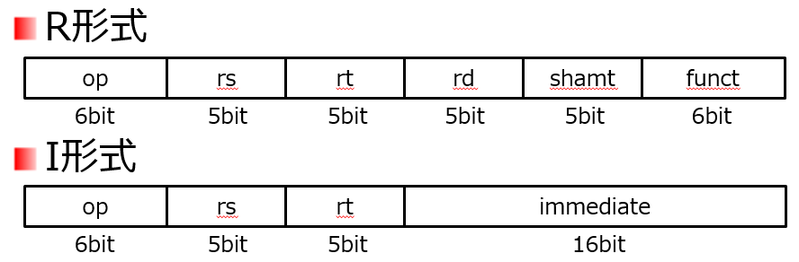
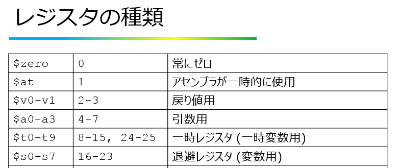
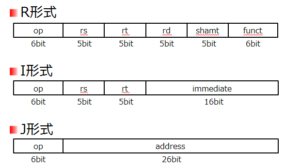

<!-- page 1 -->
# 計算機構成論 第5回

―命令セットアーキテクチャ(2)―  
大連理工大学・立命館大学 国際情報ソフトウェア学部  
双見京介

<!-- page 2 -->
## 講義内容

命令形式  
R形式、I形式とは  
命令と機械語の対応  
配列の使用に対応するアセンブリコード  
分岐処理に対応するアセンブリコード  
無条件分岐とJ形式  
大小比較命令  
アドレシング・モード

<!-- page 3 -->
## MIPSの命令形式

R形式

| op | rs | rt | rd | shamt | funct |
| ---- | ---- | ---- | ---- | ----- | ----- |
| 6bit | 5bit | 5bit | 5bit | 5bit | 6bit |

I形式

| op | rs | rt | immediate |
| ---- | ---- | ---- | --------- |
| 6bit | 5bit | 5bit | 16bit |

J形式

| op | address |
| ---- | ------- |
| 6bit | 26bit |

<!-- page 4 -->
## R形式

| op | rs | rt | rd | shamt | funct |
| ---- | ---- | ---- | ---- | ----- | ----- |
| 6bit | 5bit | 5bit | 5bit | 5bit | 6bit |

op:      命令操作コード(opcode:オペコード)  
rs:  
第1ソースオペランド(source operand)  
rt:  第2ソースオペランド  
rd:  
デスティネーションオペランド  
(destination operand)  
shamt: シフト量(shift amount)  
funct: 機能コード(function code)

<!-- page 5 -->
## R形式 (add命令の場合)

**32個のレジスタのうち1つを示す→5bit**  
不使用

| op | rs | rt | rd | shamt | funct |
| ---- | ---- | ---- | ---- | ----- | ----- |
| 6bit | 5bit | 5bit | 5bit | 5bit | 6bit |

**各フィールドと**  
**命令の対応**

```
add $s0, $s1, $s2
```

op:      命令操作コード(opcode:オペコード)  
rs:  第1ソースオペランド(source operand)  
rt:  第2ソースオペランド  
rd: デスティネーションオペランド  
(destination operand)  
shamt: シフト量(shift amount)  
funct: 機能コード(function code)

<!-- page 6 -->
## 即値オペランド

```
add a, b, c    # a = b+c
add a, b, 4    # a = b+4 ???
addi a, b, 4   # a = b+4
```

定数の加算を行う場合は、addi命令を使用  
addi: add immediate  
即値(immediate)：  
演算に使うオペランドに直接書かれた値

<!-- page 7 -->
## I形式

| op | rs | rt | immediate |
| ---- | ---- | ---- | --------- |
| 6bit | 5bit | 5bit | 16bit |

op:      命令操作コード(opcode:オペコード)  
rs:  
第1ソースオペランド(source operand)  
rt:  第2ソースオペランド  
immediate: 即値オペランド

<!-- page 8 -->
## 即値オペランド

R形式  
**32個のレジスタのうち1つを示す→5bit**

| op | rs | rt | rd | shamt | funct |
| ---- | ---- | ---- | ---- | ----- | ----- |
| 6bit | 5bit | 5bit | 5bit | 5bit | 6bit |

```
add a, b, c    # a = b+c
```

I形式  
**16bit → -32768～32767**

| op | rs | rt | immediate |
| ---- | ---- | ---- | --------- |
| 6bit | 5bit | 5bit | 16bit |

```
addi a, b, 4   # a = b+4
lw $s1, 8($s2) # 8 is immediate
sw $s1, 8($s2) # 8 is immediate
```

<!-- page 9 -->
## unsigned immediate

```
addi  a, b, -4   # a = b-4
addiu a, b, 4    # a = b+4
```

addiu命令は、符号なし整数  
(unsigned integer)の加算を行う  
addiで扱える定数は、-32768～32767  
addiuで扱える定数は、0～65535

<!-- page 10 -->
## 確認問題

以下の各命令は、R形式、I形式どちらか  
add  
addi  
addiu  
lw  
sw  
I形式のIが意味するものは何か  
R形式の命令では、いくつのオペランドが  
存在するか  
I形式の命令が保持できる即値のビット幅を  
答えよ

<!-- page 11 -->
## 確認問題

<!-- page 12 -->
## 講義内容

命令形式  
R形式、I形式とは  
命令と機械語の対応  
配列の使用に対応するアセンブリコード  
分岐処理に対応するアセンブリコード  
無条件分岐とJ形式  
大小比較命令  
アドレシング・モード

<!-- page 13 -->
## 命令と機械語の対応



| 命令 | opcode/funct | 命令 | opcode/funct |
| ----- | ------------ | --- | ------------ |
| add | 0/20 16 | sub | 0/22 16 |
| addi | 8 16 | lw | 23 16 |
| addiu | 9 16 | sw | 2B 16 |

"MIPS reference data"を参照 (試験のために数値を覚える必要はありません)

<!-- page 14 -->
## 命令と機械語の対応




<!-- page 15 -->
## 命令と機械語の対応

op          rd rs rt  
(例) `add $s0, $s1, $s2`

| op | rs | rt | rd | shamt | funct |
| ---- | ---- | ---- | ---- | ----- | ----- |
| 6bit | 5bit | 5bit | 5bit | 5bit | 6bit |

op:      命令操作コード **0**  
rs:  第1ソースオペランド **1710**  
rt:  第2ソースオペランド **1810**  
rd: **1610**  
デスティネーションオペランド  
shamt: シフト量(shift amount) **0**  
funct: 機能コード(function code) **3210**  
000000 10001 10010 10000 00000 100000

<!-- page 16 -->
## 命令と機械語の対応

op             rt rs immediate  
(例) `addi $s0, $s1,  5`

| op | rs | rt | immediate |
| ---- | ---- | ---- | --------- |
| 6bit | 5bit | 5bit | 16bit |

op:      命令操作コード **8**  
rs:  第1ソースオペランド **1710**  
rt:  第2ソースオペランド **1610**  
immediate: 即値オペランド **5**  
001000 10001 10000 0000000000000101

<!-- page 17 -->
## 命令形式の判別

コンピュータはどのように命令の形式を  
区別しているのか？  
各命令の初めの6ビット(opcode)を  
読み込めば、形式がわかるようになっている  
(例えば、0ならR形式、3510(lw)ならI形式)



<!-- page 18 -->
## シフト演算

`sll $s0, $s1, 4` …$s1の値を4ビット左に  
論理シフトして$s0に格納  
(shift left logical)  
`srl $s0, $s1, 4` …$s1の値を4ビット右に  
論理シフトして$s0に格納  
(shift right logical)  
R形式

| op | rs | rt | rd | shamt | funct |
| ---- | ---- | ---- | ---- | ----- | ----- |
| 6bit | 5bit | 5bit | 5bit | 5bit | 6bit |

`sll (rd), (rt), (shamt)` op:0 funct:0  
`srl (rd), (rt), (shamt)` op:0 funct:2

<!-- page 19 -->
## 講義内容

命令形式  
R形式、I形式とは  
命令と機械語の対応  
配列の使用に対応するアセンブリコード  
分岐処理に対応するアセンブリコード  
無条件分岐とJ形式  
大小比較命令  
アドレシング・モード

<!-- page 20 -->
## 配列の使用に対応するアセンブリコード

(例) `a[300] = b + a[200]`

```
lw $t0, 800($t1)
add $t0, $s1, $t0
sw $t0, 1200($t1)
```

a: $t1  
b: $s1

メモリアドレスのオフセットは  
配列の要素数の4倍

<!-- page 21 -->
## 配列の使用に対応するアセンブリコード

(例) `a[i] = b + a[i]`

```
sll $t2, $s2, 2
add $t2, $t2, $t1
lw $t0, 0($t2)
add $t0, $s1, $t0
sw $t0, 0($t2)
```

a: $t1  
b: $s1  
i: $s2

シフト演算を使って4倍を計算

<!-- page 22 -->
## 確認問題

```
a[50] = b - a[i]
```

… iの4倍を計算 i: $s2

```
(1) $t2, $s2, 2
```

`(2) $t2, $t2, $t1` … $t2にa[i]のアドレスを格納

```
(3) $t0, 0($t2)
```

… $t0にa[i]の値をロード  
`(4) $t0, $s1, $t0` … $t0 = $s1 - $t0  
`sw` `$t0, (5)((6))` … a[50]に$t0の値を格納

a: $t1  
b: $s1

<!-- page 23 -->
## 確認問題

<!-- page 24 -->
## 参考文献

コンピュータの構成と設計 上 第5版  
David A.Patterson, John L. Hennessy 著、  
成田光彰 訳、日経BP社  
山下茂 「計算機構成論１」講義資料
