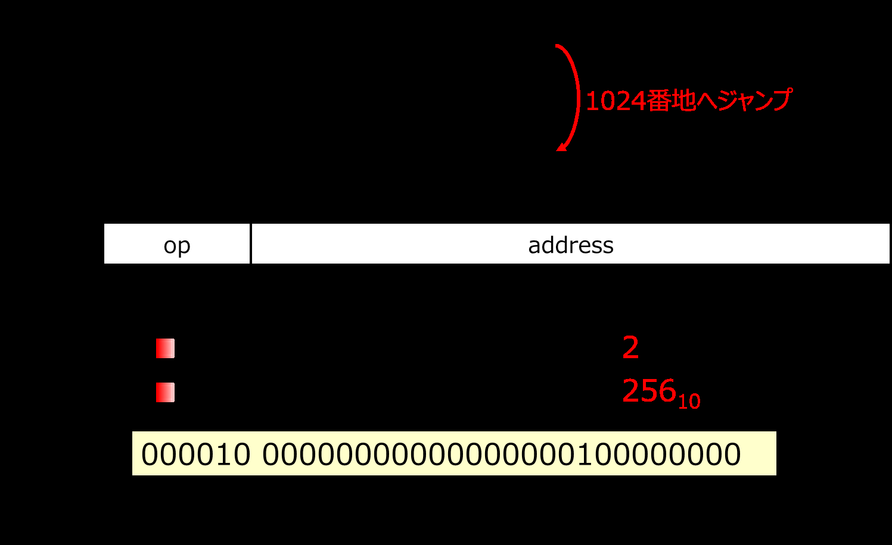
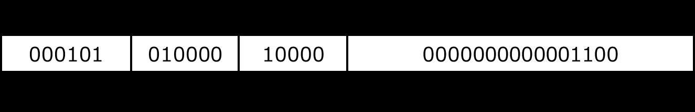

<!-- page 1 -->
# 計算機構成論 第6回

―命令セットアーキテクチャ(3)―  
大連理工大学・立命館大学 国際情報ソフトウェア学部  
双見京介

<!-- page 2 -->
## 講義内容

命令形式  
R形式、I形式とは  
命令と機械語の対応  
配列の使用に対応するアセンブリコード  
分岐処理に対応するアセンブリコード  
無条件分岐とJ形式  
大小比較命令  
アドレシング・モード

<!-- page 3 -->
## 分岐処理

C言語の条件判定、ループ(if, while, for等)を  
実現する際に使用  
`beq $s0, $s1, L1` …$s0と$s1の値が等しいとき、  
ラベルL1が付いた命令へ  
ジャンプ (branch on equal)  
`bne $s0, $s1, L1` …$s0と$s1の値が異なるとき、  
ラベルL1が付いた命令へ  
ジャンプ (branch on not equal)  
I形式

| op | rs | rt | imm. |
| ---- | ---- | ---- | ----- |
| 6bit | 5bit | 5bit | 16bit |

`beq (rs), (rt), (imm.)` 符号付き16bit整数で  
`bne (rs), (rt), (imm.)` 相対アドレス指定

<!-- page 4 -->
## 分岐処理

beq命令、bne命令は相対アドレス指定

```
beq $s0, $s1, L1
```

1000  
... `...` **+24(命令としては6つ先)**  
1024 `L1:`  
I形式

| op | rs | rt | imm. |
| ---- | ---- | ---- | ----- |
| 6bit | 5bit | 5bit | 16bit |

op:      命令操作コード **4**  
rs:  第1ソースオペランド **1610**  
rt:  第2ソースオペランド **1710** プログラムカウンタ  
immediate: 即値オペランド **5** を20+4進める  
000100 10000 10001 0000000000000101

<!-- page 5 -->
## 分岐処理

プログラムカウンタ  
PC: program counter  
現在実行中の命令が格納されている  
アドレスを保持するレジスタ  
汎用レジスタ32種類の中にはない  
MIPSの命令は32ビット(4バイト)なので、  
現在のPCが2048なら、次の命令の番地は…  
通常、1命令実行時に、PC=PC+4という  
動作を行っている  
ただし、J命令が来ると、PCの下位  
28ビットを指定された値で置き換える

<!-- page 6 -->
## 講義内容

命令形式  
R形式、I形式とは  
命令と機械語の対応  
配列の使用に対応するアセンブリコード  
分岐処理に対応するアセンブリコード  
無条件分岐とJ形式  
大小比較命令  
アドレシング・モード

<!-- page 7 -->
## 無条件分岐

無条件でジャンプ  
`j L1` …無条件でラベルL1が付いた命令へジャンプ  
J形式

| op | address |
| ---- | ------- |
| 6bit | 26bit |

op:     命令操作コード  
address: 絶対アドレス  
ただし、実際のアドレスの1/4の値  
(何番目の命令かを示す)

<!-- page 8 -->
## 無条件分岐

1000 `j L1`  
... `...`  
**1024番地へジャンプ**  
1024 `L1:`  
J形式

| op | address |
| ---- | ------- |
| 6bit | 26bit |

op:     命令操作コード **2**  
address: 絶対アドレス **25610**  
000010 00000000000000000100000000  
26bit

<!-- page 9 -->
## 無条件分岐



PCの値の変化  
0000 0000 0000 0000 0000 0011 1110 1000  
0000 0000 0000 0000 0000 0100 0000 0000  
26bit  
上位4ビットは変化しない  
下位2ビットは常に00(4倍するから)

<!-- page 10 -->
## 分岐処理に対応するアセンブリコード

(例) `if(i==j) f=g+h; else f=g-h;`

```
bne $s3, $s4, Else
add $s0, $s1, $s2
j Exit
Else: sub $s0, $s1, $s2
Exit:
```

f: $s0  
g: $s1  
h: $s2  
i: $s3  
j: $s4

<!-- page 11 -->
## 確認問題

以下のようにwhile文と、それに対応するアセンブリ  
コードがある。アセンブリコード中の空欄を埋めよ。  
(例) `while(i!=a[j]) { i=i+1; }`

```
Loop: (1) $t0, $s2, 2
add  $t0, $t0, $s1
lw $t1, 0($t0)
(2) $s0, $t1, Exit
(3)  $s0, $s0, (4)
(5)  (6)
Exit:
```

i: $s0  
a: $s1  
j: $s2

<!-- page 12 -->
## 確認問題

<!-- page 13 -->
## 確認問題

ラベルLoopの付いた命令文のアドレスは76810だと  
仮定する。これらの命令を2進数で表したとき、**赤字**  
で示したExit, Loopに対応する値は何になるか。  
それぞれ、16ビット、26ビットの2進数で答えよ。

```
Loop: beq $s0, $s1, Exit
addi $s0, $s0, 1
j    Loop
Exit:
```

<!-- page 14 -->
## 確認問題

ラベルLoopの付いた命令文のアドレスは76810だと  
仮定する。これらの命令を2進数で表したとき、**赤字**  
で示したExit, Loopに対応する値は何になるか。  
それぞれ、16ビット、26ビットの2進数で答えよ。

<!-- page 15 -->
## 確認問題

以下の命令を2進数で表したとき、**赤字**  
で示したLoopに対応する値は何になるか。  
16ビットの2進数で答えよ。

```
Loop: add  $s0, $s1, $s2
addi $s0, Ss0, 1
bne $s0, $s1, Loop
Next:
```

<!-- page 16 -->
## 確認問題

以下の命令を2進数で表したとき、**赤字**  
で示したLoopに対応する値は何になるか。  
16ビットの2進数で答えよ。

<!-- page 17 -->
## 講義内容

命令形式  
R形式、I形式とは  
命令と機械語の対応  
配列の使用に対応するアセンブリコード  
分岐処理に対応するアセンブリコード  
無条件分岐とJ形式  
大小比較命令  
アドレシング・モード

<!-- page 18 -->
## 大小比較

< に対応する比較命令  
`slt $t0, $s0, $s1` …$s0が$s1より小さいとき、  
$t0を1に設定。  
そうでなければ0に設定。  
`slti $t0, $s0, 5` …$s0が5より小さいとき、  
$t0を1に設定。  
そうでなければ0に設定。

```
slt (rd), (rs), (rt)
slti (rt), (rs), (imm.)
```

R形式  
I形式

<!-- page 19 -->
## 大小比較

(例) `while(i>=0) i=i–1;`  
i: $s1

```
Loop: slt $t0, $s1, $zero
bne $t0, $zero, Exit
addi $s1, $s1, -1
j    Loop
Exit:
```

<!-- page 20 -->
## 大小比較

slt, sltiではなぜ直接分岐しないのか  
→ 命令が複雑になりすぎるから  
→ クロックサイクル時間の延長などが  
必要になる  
\>, >=等に対応する命令は？  
擬似命令として用意されている  
アセンブラが同じ働きの命令列に変換  
blt (branch less than),  
bgt (branch greater than),  
ble (branch less or equal),  
bge (branch greater or equal)

<!-- page 21 -->
## 講義内容

命令形式  
R形式、I形式とは  
命令と機械語の対応  
配列の使用に対応するアセンブリコード  
分岐処理に対応するアセンブリコード  
無条件分岐とJ形式  
大小比較命令  
アドレシング・モード

<!-- page 22 -->
## アドレシング・モード

命令によってオペランドの解釈のしかたが異なる  
→命令が操作の対象とするもの、  
(e.g., add命令の場合の加算する値)  
命令が必要とするアドレス  
(e.g., j命令のジャンプ先アドレス)  
が命令によって異なる  
それらの解釈の方法をアドレシング・モードと呼ぶ  
アドレシング・モードの種類  
レジスタ・アドレシング (register addressing)  
ベース相対アドレシング (base addressing)  
即値アドレシング (immediate addressing)  
PC相対アドレシング (PC-relative addressing)  
擬似直接アドレシング (pseudo direct addressing)

<!-- page 23 -->
## レジスタ・アドレシング

指定したレジスタの中身をオペランドにする

```
add $t0, $s0, $s1
```


<!-- page 24 -->
## 即値アドレシング

指定した定数をオペランドにする

```
andi $s1, $s0, 24
```


<!-- page 25 -->
## ベース相対アドレシング

指定したレジスタの中身＋定数  
のメモリアドレスの内容をオペランドにする

```
lw $t0, 12($s0)
```


<!-- page 26 -->
## PC相対アドレシング

(PC+4)+(指定した定数×4) のアドレスを示す

```
bne $t0, $s0, Label
```



<!-- page 27 -->
## 擬似直接アドレシング

PCの上位4ビット と 指定した定数×4 を  
つなげたアドレスを示す

```
j Label
```


PC = 00101100000000000010011100010000  
のとき、上記命令のジャンプ先は、  
00100000000000001001110001000000

<!-- page 28 -->
## 32ビットの即値オペランド

命令長は32ビット  
→32ビットのオペランドは扱えないが…  
0000 0000 0011 1101 0000 1001 0000 0000  
上位16ビット = 6110  
下位16ビット = 230410  
上位、下位に分けて、2命令で読み込む

```
lui $s0, 61
```

…$s0の上位16ビットに  
定数を読み込む  
(load upper immediate)  
0000 0000 0011 1101 0000 0000 0000 0000  
`ori $s0, $s0, 2304` …or演算  
(or immediate)  
0000 0000 0011 1101 0000 1001 0000 0000

<!-- page 29 -->
## 32ビットの即値オペランド

\-6555210  
1111 1111 1111 1110 1111 1111 1111 0000  
上位16ビット = -210  
下位16ビット = -1610

```
lui $s0, -2
```

…$s0の上位16ビットに  
定数を読み込む  
(load upper immediate)  
1111 1111 1111 1110 0000 0000 0000 0000

```
ori $s0, $s0, -16
```

…or演算  
(or immediate)  
1111 1111 1111 1110 1111 1111 1111 0000

<!-- page 30 -->
## 確認問題

それぞれの文はどのアドレシングモード  
を説明したものか答えよ。  
(1) 指定したレジスタの中身＋定数  
のメモリアドレスの内容をオペランドにする  
(2) (PC+4)+(指定した定数×4) のアドレス  
を示す  
(3) 指定したレジスタの中身をオペランドに  
する  
(4) PCの上位4ビット と 指定した定数×4 を  
つなげたアドレスを示す  
(5) 指定した定数をオペランドにする

<!-- page 31 -->
## 確認問題

<!-- page 32 -->
## 参考文献

コンピュータの構成と設計 上 第5版  
David A.Patterson, John L. Hennessy 著、  
成田光彰 訳、日経BP社  
山下茂 「計算機構成論１」講義資料
