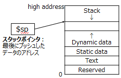

<!-- page 1 -->
# 計算機構成論第7回

―命令の実行(1)―  
大連理工大学・立命館大学国際情報ソフトウェア学部  
薛昕惟

<!-- page 2 -->
## 講義内容

命令の実行  
手続きの実行とスタック

<!-- page 3 -->
## 手続きの実行方法

手続き(procedure)  
プログラムの一部を構成する一連の処理  
C言語だと「関数」

```
int main(){
int result = function(100, 200);
```

関数呼び出し 実引数

```
...
}
```

戻り値(の型) 関数名 仮引数

```
int function(int a, int b){
return a + b;
```

関数の定義

```
}
```

※戻り値：返り値とも言う

<!-- page 4 -->
## 手続きの実行方法

手続きを実行するために必要なこと  
手続きからアクセスできる場所に  
引数の値を置く  
手続きに制御を移す  
手続き内部での処理に必要なメモリ資源を  
確保する  
手続き内部の処理を実行する  
呼び出し元からアクセスできる場所に  
結果(戻り値)を置く  
制御を元の位置に戻す

<!-- page 5 -->
## 手続きの実行方法

手続きを実行するために必要なこと  
手続きからアクセスできる場所に  
$a0-$a3  
引数の値を置く  
jal命令でPC, $ra操作  
手続きに制御を移す  
手続き内部での処理に必要なメモリ資源を  
確保する  
メモリ内  
手続き内部の処理を実行する  
呼び出し元からアクセスできる場所  
$v0-$v1  
に結果(戻り値)を置く  
制御を元の位置に戻す  
jr $ra

<!-- page 6 -->
## 手続き実行のためのレジスタ

| $zero | 0 | 常にゼロ |
| ------ | ----------- | -------------- |
| $at | 1 | アセンブラが一時的に使用 |
| $v0-v1 | 2-3 | 戻り値用 |
| $a0-a3 | 4-7 | 引数用 |
| $t0-t9 | 8-15, 24-25 | 一時レジスタ (一時変数用) |
| $s0-s7 | 16-23 | 退避レジスタ (変数用) |
| $k0-k1 | 26-27 | OSカーネル用に予約 |
| $gp | 28 | グローバルポインタ |
| $sp | 29 | スタックポインタ |
| $fp | 30 | フレームポインタ |
| $ra | 31 | リターンアドレス |

<!-- page 7 -->
## 手続きの実行

```
jal Label
```

…jump and link  
1024 jal Procedure 呼  
指定されたアドレスにジャンプすると  
同時に、次の命令のアドレスを

出  
元

レジスタ$raに保存(J形式)

```
jr $ra
```

…jump register  
指定されたレジスタに格納された  
メモリアドレスにジャンプ(R形式)  
Procedure 手続き内の処理  
… (  
右の例だと、1024番地のjal命令が  
jr $ra 出  
実行された後、$raは **1028** になる。

手  
続  
き  
呼  
先  
)

PCは1024の次は、**Procedure** になる。  
手続き内のjr命令の後、PCは **1028** になる。  
メモリ

<!-- page 8 -->
## 手続きの実行方法

引数が4個以上の場合は？  
手続きを実行するために必要なこと  
手続きからアクセスできる場所に  
$a0-$a3  
引数の値を置く  
jal命令でPC, $ra操作  
手続きに制御を移す  
手続き内部での処理に必要なメモリ資源を  
確保する  
戻り値が2個以上の場合は？メモリ内  
手続き内部の処理を実行する  
呼び出し元からアクセスできる場所  
$v0-$v1  
に結果(戻り値)を置く  
制御を元の位置に戻す  
手続きを何度も呼び出す場合は？  
jr $ra

<!-- page 9 -->
## スタック(stack)

後から入れたデータを先に取り出すデータ構造  
LIFO (last in, first out)  
スタックの先頭(トップ)にあるデータ  
(＝最後に入れたもの)にしかアクセスできない  
プッシュ(push)：  
ポップ(pop)：  
F  
F  
値の保存 値の取り出し  
「スタックにFを E 「スタックからFを E  
積む」ともいう D 下ろす」ともいう D  
C C  
B B  
A A

<!-- page 10 -->
## スタックの動作

空のスタックを考える。このスタックに対して、  
以下の操作を行ったときのスタックの変化を示せ。  
(1) データAをプッシュ  
(2) データBをプッシュ  
(3) データをポップ  
(4) データCをプッシュ  
(5) データをポップ  
(6) データをポップ

<!-- page 11 -->
## スタックの動作

空のスタックを考える。このスタックに対して、  
以下の操作を行ったときのスタックの変化を示せ。  
(1) データAをプッシュ  
(2) データBをプッシュ  
(3) データをポップ  
(4) データCをプッシュ  
(5) データをポップ  
(6) データをポップ  
B C  
A A A A A

<!-- page 12 -->
## 手続き呼び出しとスタックの関係

現在実行中の手続きの名前を  
スタックに積むとすると

```
int main(){
a();
```

(1) a をプッシュ

```
}
```

(2) b をプッシュ  
(3) ポップ

```
void a(){
```

(4) c をプッシュ

```
b();
c();
```

(5) ポップ

```
}
```

(6) ポップ  
※mainは省略  
b c  
a a a a a  
レジスタに入りきらない引数や戻り値は  
メモリ中のスタックに積まれる(スピルアウト)

<!-- page 13 -->
## 手続き呼び出しとスタックの関係

現在実行中の手続きの名前を  
他の手続きを呼ばない手続きをスタックに積むとすると

```
int main(){
```

リーフ(leaf)手続きと呼ぶ(1) a プッシュ

```
a();
```

(この例だとb()やc())(2) b をプッシュ

```
}
```

(3) ポップ

```
void a(){
```

すべてリーフだと、スタック管理は(4) c をプッシュ

```
b();
```

必須ではない(5) ポップ

```
c();
}
```

(6) ポップ  
※mainは省略  
b c  
a a a a a  
レジスタに入りきらない引数や戻り値は  
メモリ中のスタックに積まれる(スピルアウト)

<!-- page 14 -->
## スタックの実現

スタックの先頭アドレスをレジスタ$spで記憶  
メモリアドレスが大きい方がスタックの底  
＝メモリアドレスが小さい方がスタックトップ  
(スタックの一番上)  
high address  
Stack  
↓  
$sp  
↑  
**スタックポインタ**：  
Dynamic data  
最後にプッシュした  
Static data  
データのアドレス  
Text  
Reserved  
0

<!-- page 15 -->
## 手続き呼び出し時のスタック操作

② `b(x);`

`int main(){`  
①  
`a();`  
`}`  
`void a(){`  
`int x;`

① ② `c();`

```
}
```

high high  
main内で使うデータ  
main内で使うデータ main()に対応  
$sp  
a()で使うデータ a()に対応  
$sp  
low low

<!-- page 16 -->
## 手続き呼び出し時のスタック操作

③ `b(x);`  
④ `c();`  
③(b()内部実行中)  
④

```
}
```

`int main(){`  
`a();`  
`}`  
`void a(){`  
`int x;`

high high  
main内で使うデータ main()に対応 main内で使うデータ  
a()で使うデータ  
a()に対応  
a()で使うデータ  
$raの中身  
(リターンアドレス) 等  
$sp 戻り値が  
b()で使うデータ b()に対応

必要なら、  
積まれる

$sp  
low  
low

<!-- page 17 -->
## 手続き呼び出し時のスタック操作

手続きAから手続きBが呼ばれたとき、  
Aの中で使っていたレジスタ内のデータを  
メモリ(スタック)に退避させないといけない  
レジスタによって、退避させるかどうか  
決まっている  
$s0-$s7(退避レジスタ), $ra(リターンアドレス) 等は  
退避させる  
$t0-$t9(一時レジスタ)は退避しない  
上書きされないなら、退避しなくても良い  
Bが呼ばれたとき、上記レジスタの値を  
スタックにプッシュ  
Bの実行が終了したら、スタックから  
ポップして値をレジスタに戻す

`int main(){`  
`a();`  
`}`  
`void a(){`  
`b();`  
`c();`  
`}`

<!-- page 18 -->
## 手続き呼び出し時のスタック操作

レジスタ値の退避方法  
まず $sp の値を加算(**負の数**)  
sw命令で退避するレジスタの中身を  
メモリ(スタック)に書き込む



スタックトップ

<!-- page 19 -->
## 手続き呼び出し時のスタック操作

手続きフレーム ① `a();`  
その手続きを呼ぶときに新しく確保された  
スタック上の領域(スタックフレームとも)  
フレームポインタ $fp  
フレームの開始アドレスを指す  
② `b(x);`  
① high ② `}`  
$fp high  
main内で使うデータ  
main内で使うデータ  
$fp フレーム  
$sp

図再掲  
`int main(){`  
`}`  
`void a(){`  
`int x;`  
`c();`  
main()に対応する

a()で使うデータ

a()に対応する  
フレーム

$sp  
low low

<!-- page 20 -->
## 確認問題

以下のC言語のソースコードをコンパイルした結果のMIPSアセンブリコードはどうなるか

```
int leaf_example(int i, int j){
int f, g, h;
g = i+j;
h = i-j;
f = g+h;
return f;
```

レジスタの対応

```
}
```

f:$s0 g:$s1  h:$s2  i:$a0  j:$a1

```
leaf_example:
```

`addi $sp, $sp, (1)` `#`3語分確保  
`sw` `$s2, 8($sp)     #`退避  
`sw` `$s1, 4($sp)     #`退避  
`sw` `$s0, 0($sp)     #`退避 `(5)`  
`$s0, 0($sp)  #`レジスタ復元

```
add  $s1, (2), (3) #g=i+j
```

`(6)` `$s1, 4($sp)  #`レジスタ復元  
`(7)` `$s2, 8($sp)  #`レジスタ復元

```
sub  $s2, (2), (3) #h=i-j
```

`(8)` `$sp, $sp, (9)#`3語分取り除く

```
add  $s0, $s1, $s2   #f=g+h
```

`add  (4), $s0, $zero #`戻り値設定 `jr` `(10)`  
`#`呼び出し元へ戻る

<!-- page 21 -->
## 変数とスタック

スタックに利用  
high address  
ローカル変数、引数など  
Stack  
↓  
**ヒープ(heap)**  
動的変数を格納  
↑  
静的データ・セグメント  
Dynamic data  
静的変数を格納  
Static data  
テキスト・セグメント  
Text  
Reserved プログラムを格納  
0  
以下の各レジスタが保持しているものは？  
$pc  現在実行中の命令のアドレス  
$gp 静的データにアクセスするための基準アドレス  
$sp 現在のスタックの一番下位のアドレス  
$fp 現在の手続きフレームの一番上位のアドレス

<!-- page 22 -->
## 手続き呼び出し間で保持されるもの

保持される  
退避レジスタ $s0-$s7  
スタックポインタ $sp  
フレームポインタ $fp  
グローバルポインタ $gp  
リターンアドレス $ra  
保持されない  
一時レジスタ $t0-$t9  
引数レジスタ $a0-$a3  
戻り値レジスタ $v0-$v1

<!-- page 23 -->
## C言語の変数の記憶クラス

自動変数 (局所変数)  
ブロック内のみで存続  
宣言したスコープ内からアクセス可能  
スタックに置かれる  
外部変数  
プログラム実行中ずっと存続  
Dynamic data  
どこからでもアクセス可能  
静的データ・セグメントに置かれる  
静的変数 Reserved

Stack  
↓  
malloc()で  
確保したもの等  
↑  
Static data  
Text

プログラム実行中ずっと存続  
宣言したスコープ内からアクセス可能  
静的データ・セグメントに置かれる  
※ レジスタ変数  
レジスタに割り当てる自動変数

<!-- page 24 -->
## メモリの解放

動的データのメモリ解放  
C言語だとfree()  
解放し忘れ Stack  
→ メモリ・リーク(memory leak)  
→ メモリ・リークが増えると、  
新たに確保できる領域が  
Dynamic data  
なくなる  
解放が早すぎる Text  
→ 宙ぶらりんなポインタ

↓  
malloc()で  
確保したもの等  
↑  
Static data  
Reserved

(dangling pointer)が発生  
Java等の場合はガベージ・コレクション  
(garbage collection) により、  
適切に・自動的に解放が行われる

<!-- page 25 -->
## 確認問題

以下のC言語のソースコードをコンパイルした結果のMIPSアセンブリコードはどうなるか

```
int fact (int n){
if(n<1)
```

fact呼び出し時、$a0, $raの値を

```
return 1;
```

退避する必要があるとする。

```
else
```

レジスタの対応n:$a0

```
return n * fact(n-1);
}
fact: L1:
```

`addi $sp, (1), (2)` `#`2語分確保 `addi $a0, $a0, -1  #`引数`n-1`  
`sw` `$ra, 4($sp)    #`退避 `jal` `(7)`  
`#fact`呼出  
`sw` `$a0, 0($sp)    #`退避 `lw`  
`$a0, 0($sp)   #`レジスタ復元  
`slti $t0, $a0, 1    #n<1`か？  
`lw` `$ra, 4($sp)   #`レジスタ復元  
`beq` `$t0, $zero, (3)#`分岐  
`addi $sp, (8), (9) #`2語取り除く  
`addi $v0, $zero, 1  #`戻り値設定 `mul` `$v0, $a0, $v0 #n*fact(n-1)`  
`addi $sp, (4), (5)` `#`2語取り除く `jr` `(10)` `#return`

```
jr (6) #return
```

<!-- page 26 -->
## 参考文献

コンピュータの構成と設計 上第5版  
David A.Patterson, John L. Hennessy 著、  
成田光彰訳、日経BP社  
山下茂 「計算機構成論１」講義資料
