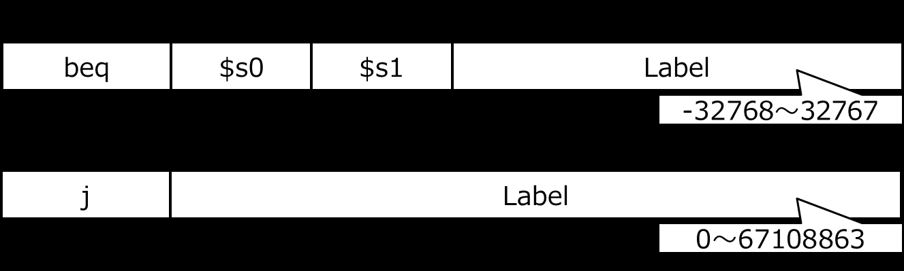
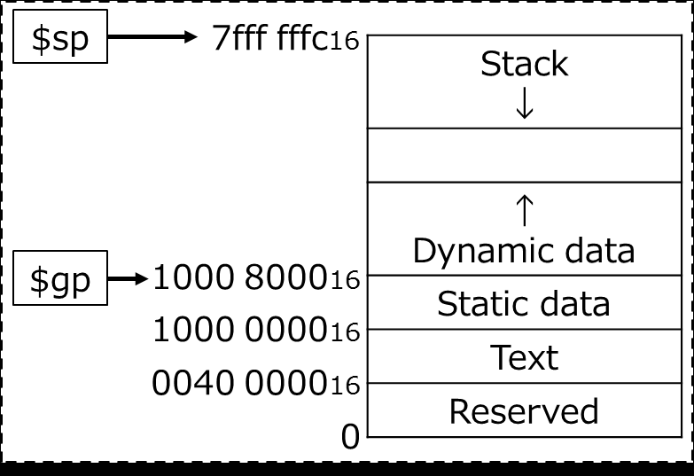
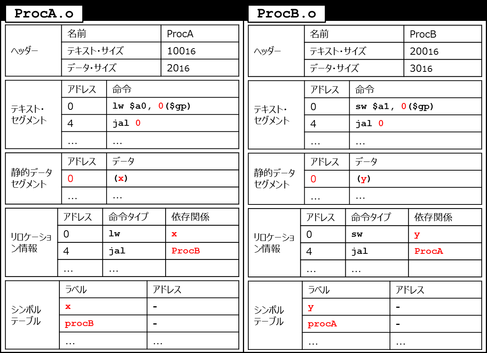

<!-- page 1 -->
# 計算機構成論第8回

―命令の実行(2)―  
大連理工大学・立命館大学国際情報ソフトウェア学部  
薛昕惟

<!-- page 2 -->
## 講義内容

命令の実行  
コンパイラ — 编译器  
アセンブラ — 汇编器  
リンカ — 链接器  
ローダ — 加载器  
Cプログラムからアセンブリコードへの  
変換  
swap, sortを例に

<!-- page 3 -->
## C言語での開発

main.c proc.c

```
int main(){
void proc(){
... ...
printf("Hello");
...
... ...
proc(); }
```

標準ライブラリ

```
...
}
```

C言語でのプログラム開発では、複数の  
ファイルを使うのが一般的  
標準ライブラリも使用  
stdio.h, stdlib.h 等々

<!-- page 4 -->
## Cプログラムが起動するまで

Cプログラム main.c Cプログラム proc.c  
コンパイラ コンパイラ  
アセンブリ言語プログラム main.s アセンブリ言語プログラム proc.s  
アセンブラ アセンブラ  
main.o proc.o  
オブジェクト：機械語モジュール オブジェクト：機械語モジュール  
a.out  
リンカ  
実行ファイル：機械語プログラム  
オブジェクト：ライブラリルーチン  
x.a, x.so

ローダ  
メモリ

<!-- page 5 -->
## コンパイラ

ソースコードをアセンブリコードに変換  
機械が解釈できるコードを  
シンボル(記号)で表したもの  
(基本的に)機械語と一対一変換可能  
アセンブリコードには擬似命令が  
含まれることがある  
擬似命令：アセンブリ言語の命令セットには  
含まれないが、簡便化のため用意されている命令  
e.g., blt (branch less than),  
move (レジスタ間のデータコピー)

<!-- page 6 -->
## 講義内容

命令の実行  
コンパイラ  
アセンブラ  
リンカ  
ローダ  
Cプログラムからアセンブリコードへの  
変換  
swap, sortを例に

<!-- page 7 -->
## アセンブラ

アセンブリコードを機械語に変換  
（アセンブルする）  
オブジェクトファイル（目的ファイル）に出力 (後述)  
擬似命令を実際の命令に置き換える  
e.g., blt $t0, $t1, Label  
→ slt $t2, $t0, $t1  
bne $t2, $zero, Label  
move $t0, $t1  
→ add $t0, $zero, $t1

<!-- page 8 -->
## アセンブラ

遠くへの分岐を、分岐＋ジャンプに変換  
beq $s0, $s1, L1



bne $s0, $s1, L2  
j L1  
L2:  
シンボル・テーブルの生成  
ラベル名と命令のアドレスの対応を管理

<!-- page 9 -->
## アセンブラ

オブジェクトファイルの生成  
以下の６セクションで構成 (UNIXの場合)  
オブジェクト・ファイル・ヘッダー (object file header)  
– テキスト・セグメント、静的データ・セグメントのサイズを示す  
テキスト・セグメント (text segment)  
– 機械語のプログラムコード  
静的データ・セグメント (static data segment)  
– 実行中に割り当てられるデータ  
リロケーション情報 (relocation information)  
– プログラムをメモリにロードしたときの絶対アドレスに依存する  
命令語、データ語を示す  
シンボル・テーブル (symbol table)  
– 未定義のラベルを保持(外部参照に使用)  
デバッグ情報 (debugging information)  
– コンパイルに関する情報。デバッガ等で使用される

<!-- page 10 -->
## 講義内容

命令の実行  
コンパイラ  
アセンブラ  
リンカ  
ローダ  
Cプログラムからアセンブリコードへの  
変換  
swap, sortを例に

<!-- page 11 -->
## リンカ

それぞれ個別にコンパイル、アセンブルされた  
プログラムをつなぎ合わせて、1つの実行可能な  
オブジェクトファイルを作る  
大規模なプログラムの全体をコンパイルし直す  
必要がなくなる  
ライブラリのような再利用性の高いものを後から  
リンクする  
外部参照を解決(e.g., 他のファイルにあるラベル名)  
メモリ上のプログラムの配置を決定  
絶対アドレシング(ベース相対アドレシングでないもの)の  
アドレスを調整(relocation)

<!-- page 12 -->
## Cプログラムが起動するまで 再掲

Cプログラム main.c Cプログラム proc.c  
コンパイラ コンパイラ  
アセンブリ言語プログラム main.s アセンブリ言語プログラム proc.s  
アセンブラ アセンブラ  
main.o proc.o  
オブジェクト：機械語モジュール オブジェクト：機械語モジュール  
a.out  
リンカ  
実行ファイル：機械語プログラム  
オブジェクト：ライブラリルーチン  
x.a, x.so

ローダ  
メモリ

<!-- page 13 -->
## (例) リンカの働き

※**赤の箇所**はリンク過程で  
更新されるデータ

```
ProcA.o ProcB.o
```

| ヘッダー | 名前 | ProcA |
| ---- | -------- | ------ |
|  | テキスト・サイズ | 100 16 |
|  | データ・サイズ | 20 16 |

| ヘッダー | 名前 | ProcB |
| ---- | -------- | ------ |
|  | テキスト・サイズ | 200 16 |
|  | データ・サイズ | 30 16 |

| テキスト・ セグメント | アドレス | 命令 |
| ----------- | ---- | -------------- |
|  | 0 | lw $a0, 0($gp) |
|  | 4 | jal 0 |
|  | ... | ... |

| テキスト・ セグメント | アドレス | 命令 |
| ----------- | ---- | -------------- |
|  | 0 | sw $a1, 0($gp) |
|  | 4 | jal 0 |
|  | ... | ... |

| 静的データ セグメント | アドレス | データ |
| ----------- | ---- | --- |
|  | 0 | (x) |
|  | ... | ... |

| 静的データ セグメント | アドレス | データ |
| ----------- | ---- | --- |
|  | 0 | (y) |
|  | ... | ... |

| リロケーショ ン情報 | アドレス | 命令タイプ | 依存関係 |
| ---------- | ---- | ----- | ----- |
|  | 0 | lw | x |
|  | 4 | jal | ProcB |
|  | ... | ... |  |

| リロケーショ ン情報 | アドレス | 命令タイプ | 依存関係 |
| ---------- | ---- | ----- | ----- |
|  | 0 | sw | y |
|  | 4 | jal | ProcA |
|  | ... | ... |  |

| シンボル テーブル | ラベル | アドレス |
| --------- | ----- | ---- |
|  | x | - |
|  | procB | - |
|  | ... | ... |

| シンボル テーブル | ラベル | アドレス |
| --------- | ----- | ---- |
|  | y | - |
|  | procA | - |
|  | ... | ... |

<!-- page 14 -->
## (例) リンカの働き

実際のメモリ上の配置(仮定)  
$sp 7fff fffc16  
Stack  
↓  
↑  
Dynamic data  
$gp 1000 800016  
Static data  
1000 000016  
Text  
0040 000016  
Reserved  
0

<!-- page 15 -->
## (例) リンカの働き



```
Linked.o
```

| ヘッダー | テキスト・サイズ | 300 16 |
| ---- | -------- | ------ |
|  | データ・サイズ | 50 16 |



| テキスト セグメント | アドレス | 命令 |
| ---------- | ------------ | --------------------- |
|  | 0040 0000 16 | lw $a0, 8000 ($gp) 16 |
|  | 0040 0004 16 | jal 40 0100 16 |
|  | ... | ... |
|  | 0040 0100 16 | sw $a1, 8020 ($gp) 16 |
|  | 0040 0104 16 | jal 40 0000 16 |
|  | … |  |

| 静的 データ セグメント | アドレス | データ |
| ------------ | ------------ | --- |
|  | 1000 0000 16 | (x) |
|  | ... | ... |
|  | 1000 0020 16 | (y) |
|  | ... | ... |

<!-- page 16 -->
## (例) リンカの働き


1000 800016 + 800016 = 1000 000016  
0001 0000 0000 0000 1000 0000 0000 0000  
1111 1111 1111 1111 1000 0000 0000 0000  
0001 0000 0000 0000 0000 0000 0000 0000

| Linked.o |  |  |  |
| -------- | ------- | --------- | -------------- |
| ヘッダー | テキス | ト・サイズ 000 |  |
|  |  |  | 130 00 10600 0 |
|  | データ・サイズ |  | 50 16 |


| テキスト セグメント | アドレス | 命令 |
| ---------- | ------------ | --------------------- |
|  | 0040 0000 16 | lw $a0, 8000 ($gp) 16 |
|  | 0040 0004 16 | jal 40 0100 16 |
|  | ... | ... |
|  | 0040 0100 16 | sw $a1, 8020 ($gp) 16 |
|  | 0040 0104 16 | jal 40 0000 16 |
|  | … |  |

1000 800016 + 802016 = 1000 002016  
0001 0000 0000 0000 1000 0000 0000 0000  
1111 1111 1111 1111 1000 0000 0010 0000  
0001 0000 0000 0000 0000 0000 0010 0000

| 静的 データ セグメント | アドレス |  | データ 1000 800 |
| ------------ | ------- | ------- | --------------- |
|  | 1000 00 | 00 16 | (x) |
|  | ... |  | 0001 0000 0 ... |
|  | 1000 00 | 20 + 16 | (y)1111 1111 1 |
|  | ... |  | ...0001 0000 0 |

<!-- page 17 -->
## 講義内容

命令の実行  
コンパイラ  
アセンブラ  
リンカ  
ローダ  
Cプログラムからアセンブリコードへの  
変換  
swap, sortを例に

<!-- page 18 -->
## ローダ

リンク後のオブジェクトファイルを  
メモリに読み込む  
main関数を実行する環境を用意  
最初の命令を呼び出す  
動的にリンクされるライブラリ  
(DLL: dynamically linked library)  
呼び出すためのダミールーチンのみ用意して、  
必要になったときに、必要な命令をテキスト  
領域に配置する

<!-- page 19 -->
## 確認問題

次の各文は、それぞれ何について説明したものか答えよ  
ソースコードをアセンブリコードに変換するソフトウェア  
アセンブリコードを機械語に変換するソフトウェア  
複数の機械語コードをつなぎあわせて  
1つのオブジェクトファイルを作るソフトウェア  
次の各項目は、オブジェクトファイルを構成する  
6つのセクションに保持されるものを示している。  
それぞれ、どのセクションか答えよ  
テキスト・セグメント、静的データ・セグメントのサイズ  
機械語のプログラムコード  
(a) 静的データ・セグメント  
(b) リロケーション情報  
実行中に割り当てられるデータ  
(c) オブジェクト・ファイル・ヘッダ  
プログラムをメモリにロードしたときの  
(d) シンボル・テーブル  
絶対アドレスに依存する命令語、データ語 (e) デバッグ情報  
未定義のラベル  
(f) テキスト・セグメント  
デバッガ等で使用されるコンパイルに関する情報

<!-- page 20 -->
## 講義内容

命令の実行  
コンパイラ  
アセンブラ  
リンカ  
ローダ  
Cプログラムからアセンブリコードへの  
変換  
swap, sortを例に

<!-- page 21 -->
## Cプログラムからアセンブリコードへの変換

以下のC言語のソースコードをアセンブリコードに直せ。

```
void swap(int v[], int k){
int t;
```

レジスタ割り付け：

```
t = v[k];
```

$a0:v  $a1:k

```
v[k] = v[k+1];
```

$t0:t

```
v[k+1] = t;
}
swap:
sll $t1, $a1,  (1) #$t1 = k*4
add $t1, (2),  (3) #$t1 = &(v[k])
lw $t0, ( 4 ) #t = v[k]
lw $t2, ( 5 ) #$t2 = v[k+1]
sw $t2, ( 6 ) #v[k] = $t2
sw $t0, ( 7 ) #v[k+1] = t
jr $ra #return
```

<!-- page 22 -->
## Cプログラムからアセンブリコードへの変換

以下のC言語のソースコードをアセンブリコードに直せ。

```
void swap(int v[], int k){
int t;
```

レジスタ割り付け：

```
t = v[k];
```

$a0:v  $a1:k

```
v[k] = v[k+1];
```

$t0:t

```
v[k+1] = t;
}
swap:
sll $t1, $a1,  2 #$t1 = k*4
add $t1, $a0,  $t1 #$t1 = &(v[k])
lw $t0, 0($t1) #t = v[k]
lw $t2, 4($t1) #$t2 = v[k+1]
sw $t2, 0($t1) #v[k] = $t2
sw $t0, 4($t1) #v[k+1] = t
jr $ra #return
```

<!-- page 23 -->
## Cプログラムからアセンブリコードへの変換

以下のC言語のソースコードをアセンブリコードに直せ。

```
void sort(int v[], int n){
int i, j;
```

$a0:v  $a1:n  
$s0:i  $s1:j

```
for(i=0; i<n; i++){
for(j=i-1; j>=0 && v[j]>v[j+1]; j--){
swap(v,j);
}}}
```

手順  
①レジスタの退避  
②引数の退避  
③外側のループ  
④内側のループ  
⑤swap呼出  
⑥内側のループ  
⑦外側のループ  
⑧レジスタ復元～

<!-- page 24 -->
## Cプログラムからアセンブリコードへの変換

以下のC言語のソースコードをアセンブリコードに直せ。

```
void sort(int v[], int n){
int i, j;
for(i=0; i<n; i++){
for(j=i-1; j>=0 && v[j]>v[j+1]; j--){
swap(v,j);
}}}
sort:
addi $sp, $sp, -20
sw $ra, 16($sp)
```

**①レジスタの退避**  
②引数の退避  
③外側のループ  
④内側のループ  
⑤swap呼出  
⑥内側のループ  
⑦外側のループ  
⑧レジスタ復元～  
$a0:v  $a1:n  
$s0:i  $s1:j

```
sw $s3, 12($sp)
sw $s2, 8($sp)
sw $s1, 4($sp)
```

$spを必要なだけ進めて、

```
sw $s0, 0($sp)
```

手続き内で使用するレジスタ  
の値を退避

<!-- page 25 -->
## Cプログラムからアセンブリコードへの変換

以下のC言語のソースコードをアセンブリコードに直せ。

```
void sort(int v[], int n){
int i, j;
for(i=0; i<n; i++){
for(j=i-1; j>=0 && v[j]>v[j+1]; j--){
swap(v,j);
}}}
move $s2, $a0
move $s3, $a1
```

swap(v, j) (5行目)で実引数を $s0:i  $s1:j  
設定するときにa0, a1を使用する $s2:v  $s3:n

①レジスタの退避  
**②引数の退避**  
③外側のループ  
④内側のループ  
⑤swap呼出  
⑥内側のループ  
⑦外側のループ  
⑧レジスタ復元～  
$a0:v  $a1:n

ので、値をコピーしておく

<!-- page 26 -->
## Cプログラムからアセンブリコードへの変換

以下のC言語のソースコードをアセンブリコードに直せ。

```
void sort(int v[], int n){
int i, j;
for(i=0; i<n; i++){
for(j=i-1; j>=0 && v[j]>v[j+1]; j--){
swap(v,j);
}}}
move $s0, $zero
```

i=0

```
for1tst:
slt $t0, $s0, $s3
beq $t0, $zero, exit1
```

①レジスタの退避  
②引数の退避  
**③外側のループ**  
④内側のループ  
⑤swap呼出  
⑥内側のループ  
⑦外側のループ  
⑧レジスタ復元～  
$a0:v  $a1:n  
$s0:i  $s1:j  
$s2:v  $s3:n

i<n が満たされ  
なければexit1へ  
ジャンプ

<!-- page 27 -->
## Cプログラムからアセンブリコードへの変換

以下のC言語のソースコードをアセンブリコードに直せ。

```
void sort(int v[], int n){
int i, j;
for(i=0; i<n; i++){
for(j=i-1; j>=0 && v[j]>v[j+1]; j--){
swap(v,j);
}}}
```

①レジスタの退避  
②引数の退避  
③外側のループ  
**④内側のループ**  
⑤swap呼出  
⑥内側のループ  
⑦外側のループ

j=i-1 ⑧レジスタ復元～

```
addi $s1, $s0, -1
for2tst:
```

j<0であれば、 $a0:v  $a1:n

```
slti $t0, $s1, 0
```

exit2へ

```
bne $t0, $zero, exit2
```

$t1=j*4

```
sll $t1, $s1, 2
```

$t2=&(v[j])

```
add  $t2, $s2, $t1
```

$s0:i  $s1:j  
$s2:v  $s3:n

$t3=v[j]

```
lw $t3, 0($t2)
```

$t4=v[j+1]

```
lw $t4, 4($t2)
slt $t0, $t4, $t3
```

$t3<$t4で  
`beq` `$t0, $zero, exit2` あればexit2へ

<!-- page 28 -->
## Cプログラムからアセンブリコードへの変換

以下のC言語のソースコードをアセンブリコードに直せ。

```
void sort(int v[], int n){
int i, j;
for(i=0; i<n; i++){
for(j=i-1; j>=0 && v[j]>v[j+1]; j--){
swap(v,j);
}}}
move $a0, $s2
```

引数を設定して、

```
move $a1, $s1
```

swap呼び出し

```
jal swap
```

①レジスタの退避  
②引数の退避  
③外側のループ  
④内側のループ  
**⑤swap呼出**  
⑥内側のループ  
⑦外側のループ  
⑧レジスタ復元～  
$a0:v  $a1:n  
$s0:i  $s1:j  
$s2:v  $s3:n

<!-- page 29 -->
## Cプログラムからアセンブリコードへの変換

以下のC言語のソースコードをアセンブリコードに直せ。

```
void sort(int v[], int n){
int i, j;
for(i=0; i<n; i++){
for(j=i-1; j>=0 && v[j]>v[j+1]; j--){
swap(v,j);
}}}
```

`addi $s1, $s1, -1` j--して  
内側ループの条件

```
j    for2tst
```

判定へ戻る

①レジスタの退避  
②引数の退避  
③外側のループ  
④内側のループ  
⑤swap呼出  
**⑥内側のループ**  
⑦外側のループ  
⑧レジスタ復元～  
$a0:v  $a1:n  
$s0:i  $s1:j  
$s2:v  $s3:n

<!-- page 30 -->
## Cプログラムからアセンブリコードへの変換

以下のC言語のソースコードをアセンブリコードに直せ。

```
void sort(int v[], int n){
int i, j;
for(i=0; i<n; i++){
for(j=i-1; j>=0 && v[j]>v[j+1]; j--){
swap(v,j);
}}}
```

i++して

```
exit2:
```

`addi $s0, $s0, 1` 外側ループの条件  
判定へ戻る

```
j    for1tst
```

①レジスタの退避  
②引数の退避  
③外側のループ  
④内側のループ  
⑤swap呼出  
⑥内側のループ  
**⑦外側のループ**  
⑧レジスタ復元～  
$a0:v  $a1:n  
$s0:i  $s1:j  
$s2:v  $s3:n

<!-- page 31 -->
## Cプログラムからアセンブリコードへの変換

以下のC言語のソースコードをアセンブリコードに直せ。

```
void sort(int v[], int n){
int i, j;
for(i=0; i<n; i++){
for(j=i-1; j>=0 && v[j]>v[j+1]; j--){
swap(v,j);
}}}
exit1:
```

①レジスタの退避  
②引数の退避  
③外側のループ  
④内側のループ  
⑤swap呼出  
⑥内側のループ  
⑦外側のループ  
**⑧レジスタ復元～**

```
lw $s0, 0($sp)
lw $s1, 4($sp)
```

レジスタ復元

```
lw $s2, 8($sp)
lw $s3, 12($sp)
lw $ra, 16($sp)
addi $sp, $sp, 20
```

呼び出し元へ戻る

```
jr $ra
```

<!-- page 32 -->
## sort:Cプログラムからアセンブリコードへの変換addi $sp, $sp, -20 lw $t3, 0($t2)$t4, 4($t2)

```
sw $ra, 16($sp) slt $t0, $t4, $t3
sw $s3, 12($sp) beq $t0, $zero, exit2
sw $s2, 8($sp)
move $a0, $s2
sw $s1, 4($sp)
move $a1, $s1
sw $s0, 0($sp) jal swap
move $s2, $a0
addi $s1, $s1, -1
move $s3, $a1
j    for2tst
move $s0, $zero
exit2:
for1tst:
addi $s0, $s0, 1
slt $t0, $s0, $s3 j    for1tst
beq $t0, $zero, exit1   exit1:
addi $s1, $s0, -1
lw $s0, 0($sp)
for2tst: lw $s1, 4($sp)
slti $t0, $s1, 0
lw $s2, 8($sp)
bne $t0, $zero, exit2 lw $s3, 12($sp)
sll $t1, $s1, 2 lw $ra, 16($sp)
add  $t2, $s2, $t1
addi $sp, $sp, 20
jr $ra
```

<!-- page 33 -->
## 参考文献

コンピュータの構成と設計 上第5版  
David A.Patterson, John L. Hennessy 著、  
成田光彰訳、日経BP社  
山下茂 「計算機構成論１」講義資料
